# GreenPulse System Workflows Documentation

## Overview

This document outlines all operational workflows within the GreenPulse system, covering user interactions, automated processes, and system operations. Each workflow includes detailed steps, decision points, and error handling procedures.

## Table of Contents

1. [User Workflows](#user-workflows)
2. [Automated System Workflows](#automated-system-workflows)
3. [Data Processing Workflows](#data-processing-workflows)
4. [Monitoring and Alerting Workflows](#monitoring-and-alerting-workflows)
5. [Maintenance Workflows](#maintenance-workflows)
6. [Emergency Response Workflows](#emergency-response-workflows)

## User Workflows

### 1. Park Management Workflow

#### 1.1 Create New Park
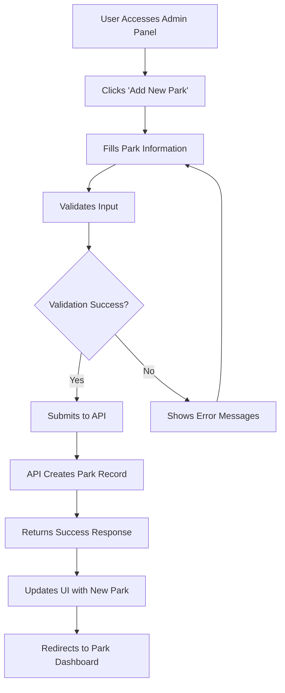

**Detailed Steps:**
1. **Navigation**: User navigates to `/admin/parks`
2. **Form Entry**: User enters park details:
   - Park ID (unique identifier)
   - Park name
   - Geographic coordinates
   - Area in square meters
   - Tree count (optional)
   - Description (optional)
3. **Validation**: Frontend validates:
   - Required fields filled
   - Coordinate format valid
   - Park ID unique
4. **API Submission**: POST request to `/api/parks`
5. **Database Storage**: Park record created in MongoDB
6. **UI Update**: Success message and redirect

**Error Handling:**
- Duplicate park ID: Show error, suggest alternative
- Invalid coordinates: Show map for manual selection
- Network error: Offer retry option

#### 1.2 Update Park Information
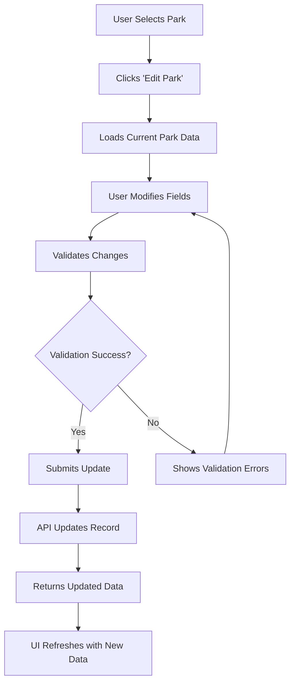

### 2. Dashboard Interaction Workflow

#### 2.1 Real-time Monitoring
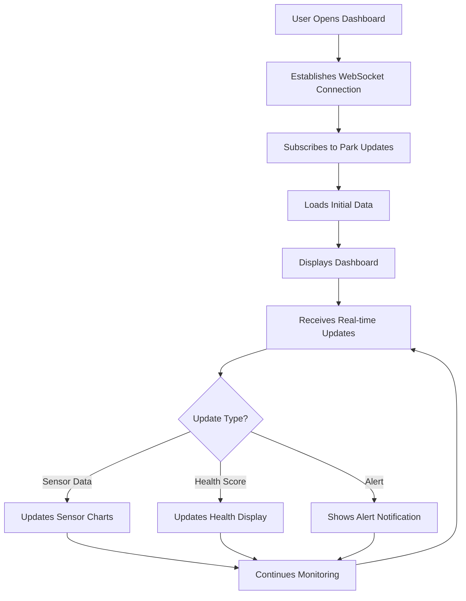

**WebSocket Message Types:**
- `sensor_update`: New sensor readings
- `health_update`: Updated health scores
- `alert`: System alerts and notifications
- `node_status`: IoT node online/offline status

#### 2.2 Historical Data Analysis
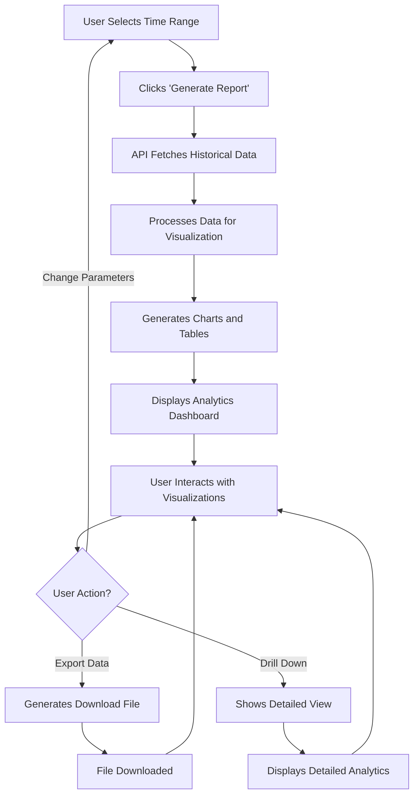

### 3. IoT Node Management Workflow

#### 3.1 Node Registration
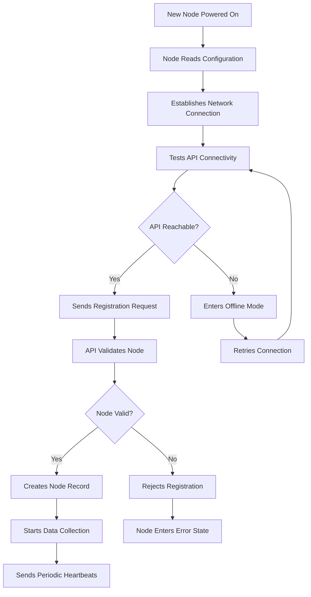

**Node Registration Data:**
```json
{
  "node_id": "node_001",
  "park_id": "park_001",
  "firmware_version": "1.0.0",
  "hardware_version": "v1.0",
  "sensor_types": ["temperature", "humidity", "soil_moisture", "light_intensity"],
  "capabilities": ["camera", "wifi", "ethernet"],
  "location": {"lat": 28.6139, "lon": 77.2090}
}
```

#### 3.2 Sensor Data Collection Cycle
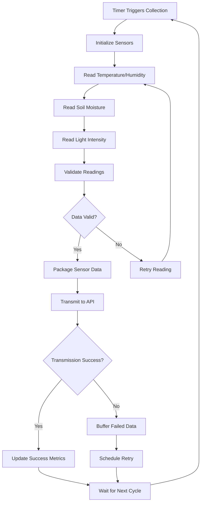

## Automated System Workflows

### 1. Data Processing Pipeline

#### 1.1 Real-time Data Processing
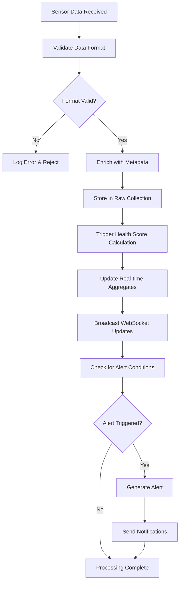

**Data Enrichment Process:**
```python
def enrich_sensor_data(raw_data):
    enriched = raw_data.copy()
    
    # Add geographic context
    enriched["geographic_region"] = determine_region(raw_data["location"])
    
    # Add temporal context
    enriched["time_of_day"] = categorize_time(raw_data["timestamp"])
    enriched["season"] = determine_season(raw_data["timestamp"])
    
    # Add quality metrics
    enriched["data_quality"] = calculate_quality_score(raw_data)
    
    # Add historical context
    enriched["historical_comparison"] = get_historical_comparison(raw_data)
    
    return enriched
```

#### 1.2 Health Score Calculation Workflow
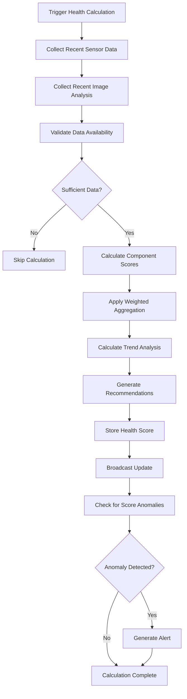

### 2. Background Processing Workflows

#### 2.1 Hourly Data Aggregation
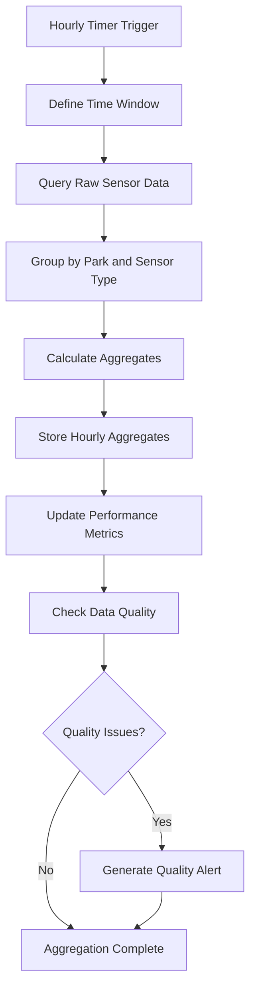

**Aggregation Calculations:**
```python
def calculate_hourly_aggregates(raw_data):
    aggregates = {}
    
    for sensor_type in SENSOR_TYPES:
        values = [reading["value"] for reading in raw_data 
                 if reading["sensor_type"] == sensor_type]
        
        if values:
            aggregates[sensor_type] = {
                "avg_value": np.mean(values),
                "min_value": np.min(values),
                "max_value": np.max(values),
                "std_dev": np.std(values),
                "count": len(values),
                "quality_score": calculate_data_quality(values)
            }
    
    return aggregates
```

#### 2.2 Daily Report Generation
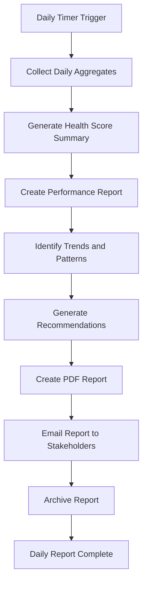

### 3. Maintenance Workflows

#### 3.1 Database Maintenance
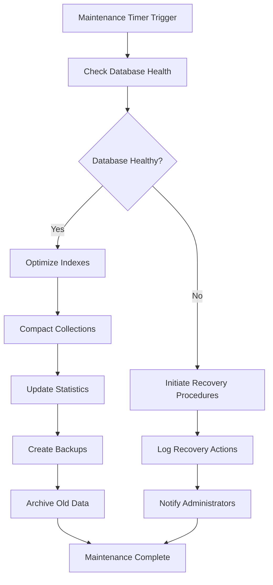

#### 3.2 System Health Monitoring
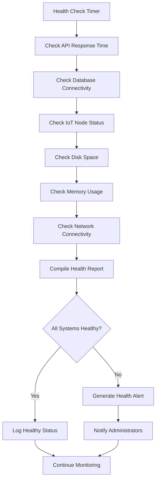

## Data Processing Workflows

### 1. Image Analysis Pipeline

#### 1.1 Vegetation Health Analysis
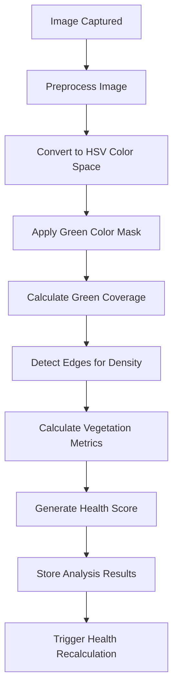

**Image Processing Steps:**
```python
def analyze_vegetation_health(image_path):
    # Step 1: Load and preprocess
    image = cv2.imread(image_path)
    resized = cv2.resize(image, (1296, 972))
    
    # Step 2: Color analysis
    hsv = cv2.cvtColor(resized, cv2.COLOR_BGR2HSV)
    green_mask = create_green_mask(hsv)
    green_percentage = calculate_coverage(green_mask)
    
    # Step 3: Texture analysis
    gray = cv2.cvtColor(resized, cv2.COLOR_BGR2GRAY)
    edges = cv2.Canny(gray, 50, 150)
    texture_density = calculate_texture_density(edges)
    
    # Step 4: Health scoring
    health_score = calculate_vegetation_health_score(
        green_percentage, texture_density
    )
    
    return {
        "health_score": health_score,
        "green_coverage": green_percentage,
        "texture_density": texture_density,
        "analysis_timestamp": datetime.utcnow()
    }
```

#### 1.2 Biodiversity Assessment
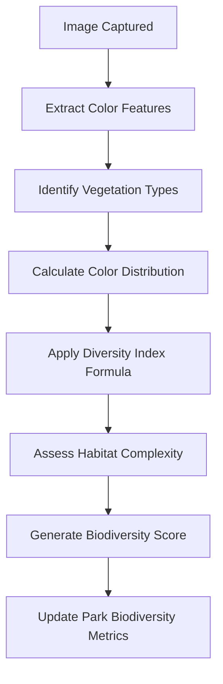

### 2. Anomaly Detection Workflow

#### 2.1 Sensor Anomaly Detection
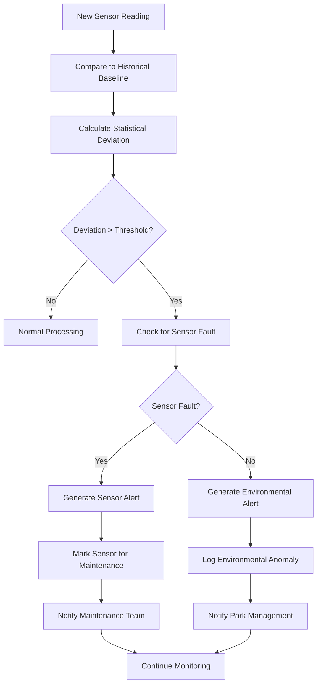

**Anomaly Detection Algorithm:**
```python
def detect_sensor_anomaly(reading, historical_data):
    # Calculate baseline statistics
    values = [r["value"] for r in historical_data]
    mean = np.mean(values)
    std_dev = np.std(values)
    
    # Calculate z-score
    z_score = abs(reading["value"] - mean) / std_dev
    
    # Determine anomaly level
    if z_score > 3:
        return "critical", "Extreme deviation detected"
    elif z_score > 2:
        return "high", "Significant deviation detected"
    elif z_score > 1.5:
        return "medium", "Moderate deviation detected"
    else:
        return "normal", "Within expected range"
```

#### 2.2 Health Score Trend Analysis
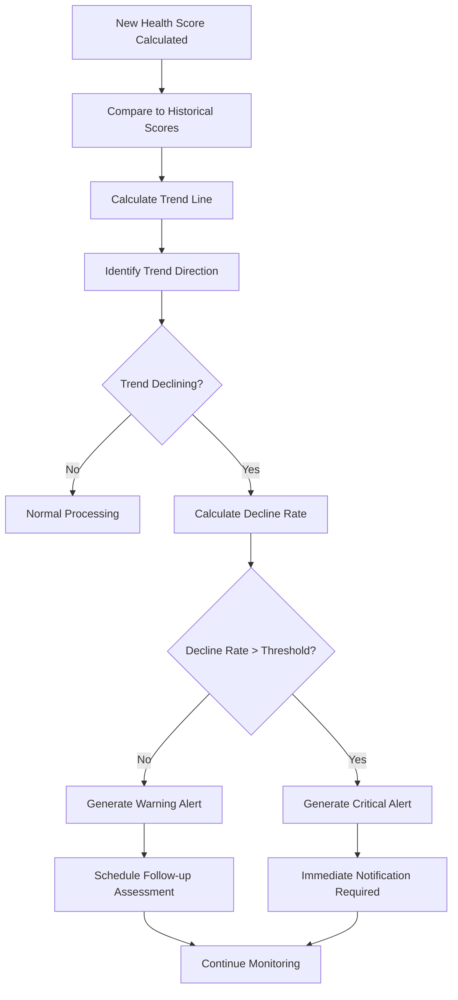

## Monitoring and Alerting Workflows

### 1. Alert Generation Workflow

#### 1.1 Alert Classification
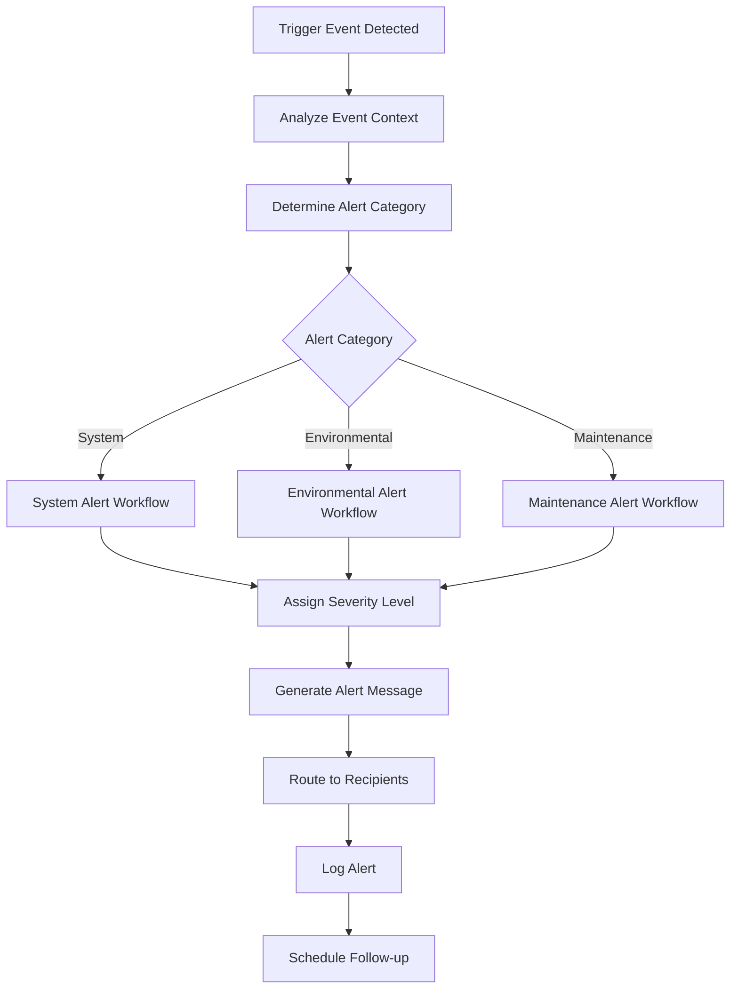

**Alert Severity Classification:**
```python
def classify_alert_severity(event_type, impact_level, urgency):
    if event_type == "sensor_failure":
        return "critical"
    elif event_type == "health_decline" and impact_level > 0.5:
        return "high"
    elif event_type == "environmental_anomaly" and urgency == "immediate":
        return "high"
    elif impact_level > 0.3:
        return "medium"
    else:
        return "low"
```

#### 1.2 Notification Routing
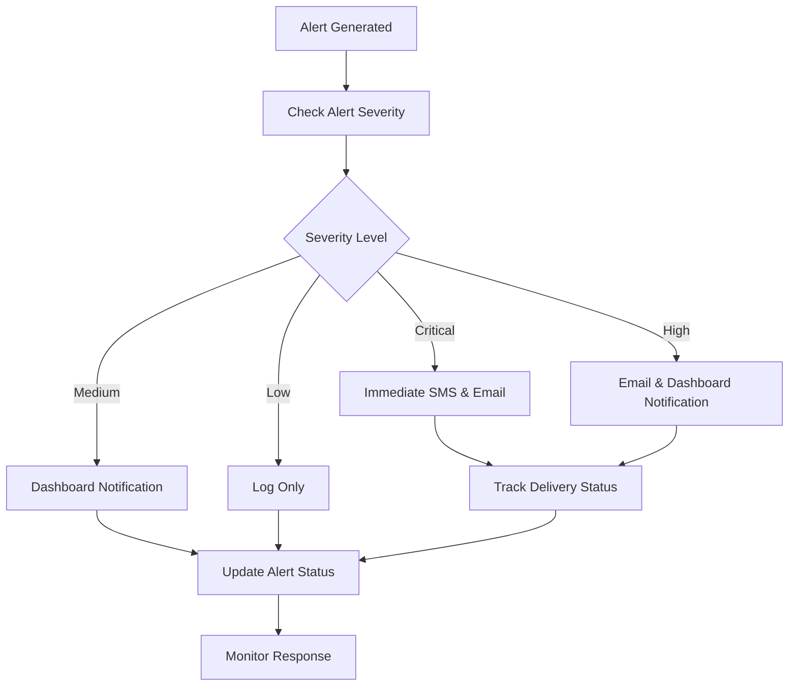

### 2. System Health Monitoring

#### 2.1 Component Health Checks
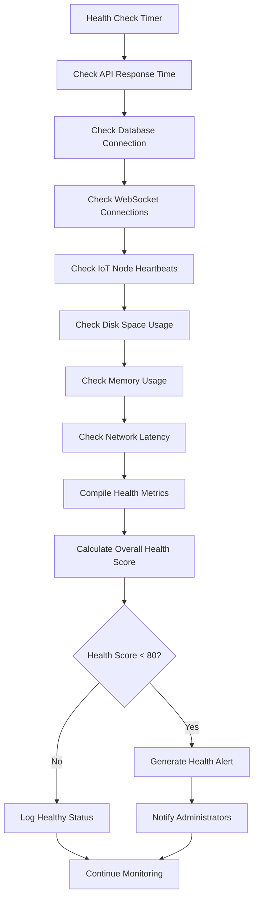

#### 2.2 Performance Monitoring
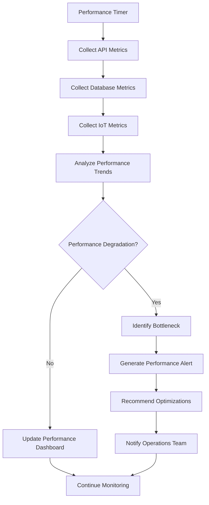

## Maintenance Workflows

### 1. Scheduled Maintenance

#### 1.1 Daily Maintenance Tasks
```mermaid
flowchart TD
    A[Daily Maintenance Timer] --> B[Database Backup]
    B --> C[Log File Rotation]
    C --> D[Cache Cleanup]
    D --> E[Performance Metrics Collection]
    E --> F[Health Score Verification]
    F --> G[Data Quality Checks]
    G --> H[Generate Daily Report]
    H --> I[Archive Maintenance Logs]
    I --> J[Daily Maintenance Complete]
```

#### 1.2 Weekly Maintenance Tasks
```mermaid
flowchart TD
    A[Weekly Maintenance Timer] --> B[Database Optimization]
    B --> C[Index Rebuilding]
    C --> D[System Security Updates]
    D --> E[Performance Baseline Update]
    E --> F[IoT Node Firmware Check]
    F --> G[Storage Capacity Review]
    G --> H[Generate Weekly Report]
    H --> I[Schedule Maintenance Window]
    I --> J[Weekly Maintenance Complete]
```

### 2. Emergency Maintenance

#### 2.1 System Failure Response
```mermaid
flowchart TD
    A[Failure Detected] --> B[Assess Impact Scope]
    B --> C{Critical System?}
    C -->|Yes| D[Activate Emergency Response]
    C -->|No| E[Standard Troubleshooting]
    D --> F[Notify All Stakeholders]
    F --> G[Initiate Failover Procedures]
    G --> H[Start Recovery Process]
    H --> I[Verify System Recovery]
    I --> J{System Recovered?}
    J -->|No| K[Escalate to Critical Incident]
    J -->|Yes| L[Document Incident]
    K --> M[Engage Senior Leadership]
    L --> N[Conduct Post-Mortem]
    M --> H
    N --> O[Update Procedures]
    O --> P[Recovery Complete]
```

#### 2.2 Data Recovery Procedures
```mermaid
flowchart TD
    A[Data Corruption Detected] --> B[Isolate Affected Systems]
    B --> C[Identify Corruption Scope]
    C --> D{Backup Available?}
    D -->|Yes| E[Initiate Restore Procedure]
    D -->|No| F[Attempt Data Repair]
    E --> G[Restore from Latest Backup]
    G --> H[Verify Data Integrity]
    H --> I{Data Valid?}
    I -->|No| J[Try Earlier Backup]
    I -->|Yes| K[Resume Normal Operations]
    J --> G
    F --> L{Repair Successful?}
    L -->|Yes| M[Validate Repaired Data]
    L -->|No| N[Escalate to Data Recovery Team]
    M --> K
    N --> O[Engage External Specialists]
```

## Emergency Response Workflows

### 1. Critical Alert Response

#### 1.1 Environmental Emergency
```mermaid
flowchart TD
    A[Critical Environmental Alert] --> B[Verify Alert Validity]
    B --> C{Alert Confirmed?}
    C -->|No| D[Mark as False Positive]
    C -->|Yes| E[Activate Emergency Protocol]
    E --> F[Notify Park Management]
    F --> G[Notify Environmental Agencies]
    G --> H[Deploy Field Team]
    H --> I[Initiate Continuous Monitoring]
    I --> J[Provide Regular Updates]
    J --> K[Document Response Actions]
    K --> L[Review Emergency Response]
```

#### 1.2 System Emergency
```mermaid
flowchart TD
    A[System Failure Alert] --> B[Assess System Impact]
    B --> C{Core Services Affected?}
    C -->|Yes| D[Activate Disaster Recovery]
    C -->|No| E[Standard Recovery Procedures]
    D --> F[Switch to Backup Systems]
    F --> G[Notify All Users]
    G --> H[Initiate Full System Restore]
    H --> I[Verify System Functionality]
    I --> J[Return to Primary Systems]
    E --> K[Troubleshoot Issue]
    K --> L[Apply Fix]
    L --> M[Verify Resolution]
    M --> N[Restore Full Service]
```

### 2. Communication Workflows

#### 2.1 Stakeholder Notification
```mermaid
flowchart TD
    A[Event Requiring Notification] --> B[Identify Affected Stakeholders]
    B --> C[Determine Communication Channels]
    C --> D[Draft Notification Message]
    D --> E[Review Message Content]
    E --> F{Message Approved?}
    F -->|No| G[Revise Message]
    F -->|Yes| H[Send Notifications]
    G --> D
    H --> I[Track Delivery Status]
    I --> J[Log Communication]
    J --> K[Monitor for Responses]
    K --> L[Follow-up if Needed]
```

#### 2.2 Incident Reporting
```mermaid
flowchart TD
    A[Incident Occurs] --> B[Document Initial Details]
    B --> C[Assess Incident Severity]
    C --> D[Create Incident Report]
    D --> E[Notify Response Team]
    E --> F[Begin Investigation]
    F --> G[Collect Evidence]
    G --> H[Analyze Root Cause]
    H --> I[Develop Resolution Plan]
    I --> J[Implement Resolution]
    J --> K[Verify Resolution Success]
    K --> L[Complete Incident Report]
    L --> M[Share Lessons Learned]
```

This comprehensive system workflows documentation provides detailed operational procedures for all aspects of the GreenPulse system, ensuring consistent and reliable operations across all scenarios.
